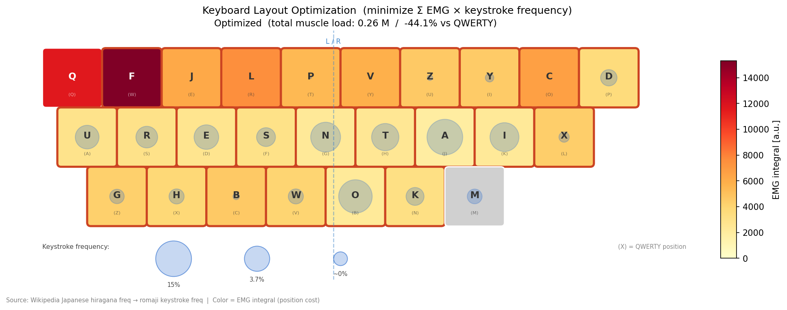

# EMG Keyboard Analysis

Electromyography (EMG) analysis of muscle activity during QWERTY keyboard typing, with Japanese keystroke frequency comparison and keyboard layout optimization.

## Overview

Surface EMG was recorded from 2 channels (CH1: left hand, CH2: right hand) while typing each alphabetic key on a QWERTY keyboard in order (q → w → e → ... → n). This repository contains the processing pipeline (converted from MATLAB to Python) and analysis scripts.

## Data

- **Device**: biosignalsplux (OpenSignals format)
- **Sampling rate**: 1000 Hz
- **Channels**: 2 (EMG × 2 muscles)
- **Files**: 25 recordings in `alphabet/` — sorted by timestamp → mapped to QWERTY key order (q, w, e, r, t, y, u, i, o, p, a, s, d, f, g, h, j, k, l, z, x, c, v, b, n)

## Processing Pipeline

```
Raw EMG
  → Bandpass filter  (Butterworth 4th order, 40–400 Hz)
  → Zero-mean        (baseline removal)
  → Rectification    (absolute value)
  → RMS smoothing    (100-sample sliding window)
```

## Analyses

### 1. EMG Overview (`emg_overview.png`)
Filtered EMG waveforms for all 25 keys × 2 channels.

### 2. Activity Ranking (`emg_ranking.png`, `emg_ranking_sum.png`)
Keys ranked by integral and peak value per channel, and by CH1+CH2 sum.

### 3. Keystroke Frequency vs EMG (`emg_vs_frequency.png`, `emg_correlation_*.png`)
Japanese romaji keystroke frequency (derived from Wikipedia hiragana frequency data, ~20M characters) compared against EMG integral values.

- Hiragana frequency source: [Wikipedia — 文字の出現頻度](https://ja.wikipedia.org/wiki/%E6%96%87%E5%AD%97%E3%81%AE%E5%87%BA%E7%8F%BE%E9%A0%BB%E5%BA%A6)
- Conversion: Nihon-shiki romaji (MS-IME/Google IME standard)

### 4. Keyboard Heatmap (`keyboard_heatmap.png`, `keyboard_compare.png`)
EMG activity and keystroke frequency mapped onto QWERTY keyboard layout.

### 5. Layout Optimization (`keyboard_optimized.png`)
Hungarian algorithm (linear assignment) minimizes total muscle load:

```
minimize  Σ  EMG(position_i) × frequency(letter_j)
```

Result: **−44.1% reduction** in total muscle load vs QWERTY.

- Background color = EMG cost of each key position
- Circle size = keystroke frequency of assigned letter



## Usage

```bash
pip install numpy scipy matplotlib
python process_EMG.py
```

All figures are saved to the project directory.

## Requirements

- Python 3.10+
- numpy
- scipy
- matplotlib

## File Structure

```
EMG_analysis/
├── process_EMG.py        # Main analysis script (MATLAB → Python)
├── process_EMG.m         # Original MATLAB script
├── alphabet/             # Raw OpenSignals .txt recordings (25 keys)
├── emg_overview.png
├── emg_ranking.png
├── emg_ranking_sum.png
├── emg_vs_frequency.png
├── emg_correlation_all.png
├── emg_correlation_excl_wq.png
├── keyboard_heatmap.png
├── keyboard_compare.png
└── keyboard_optimized.png
```
