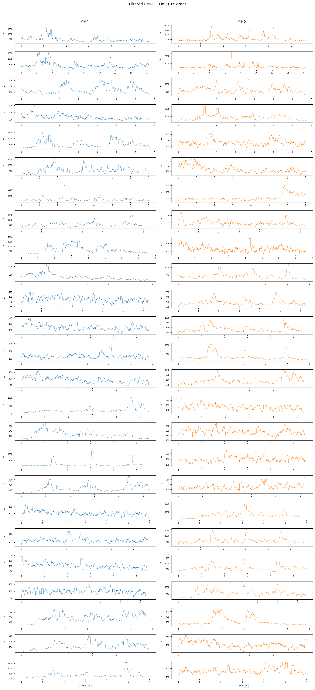
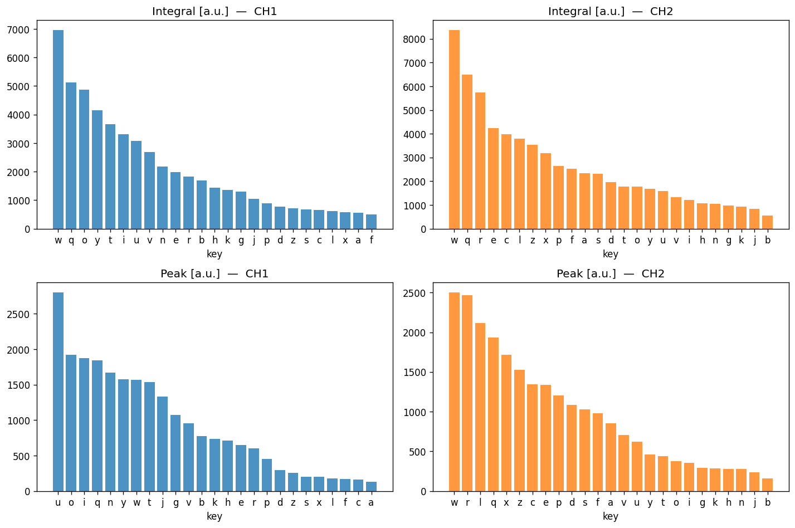
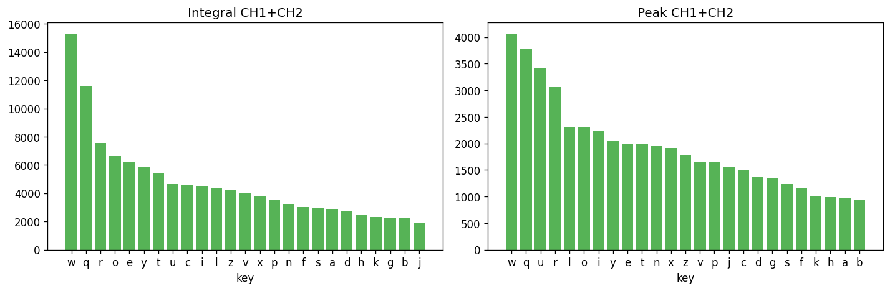
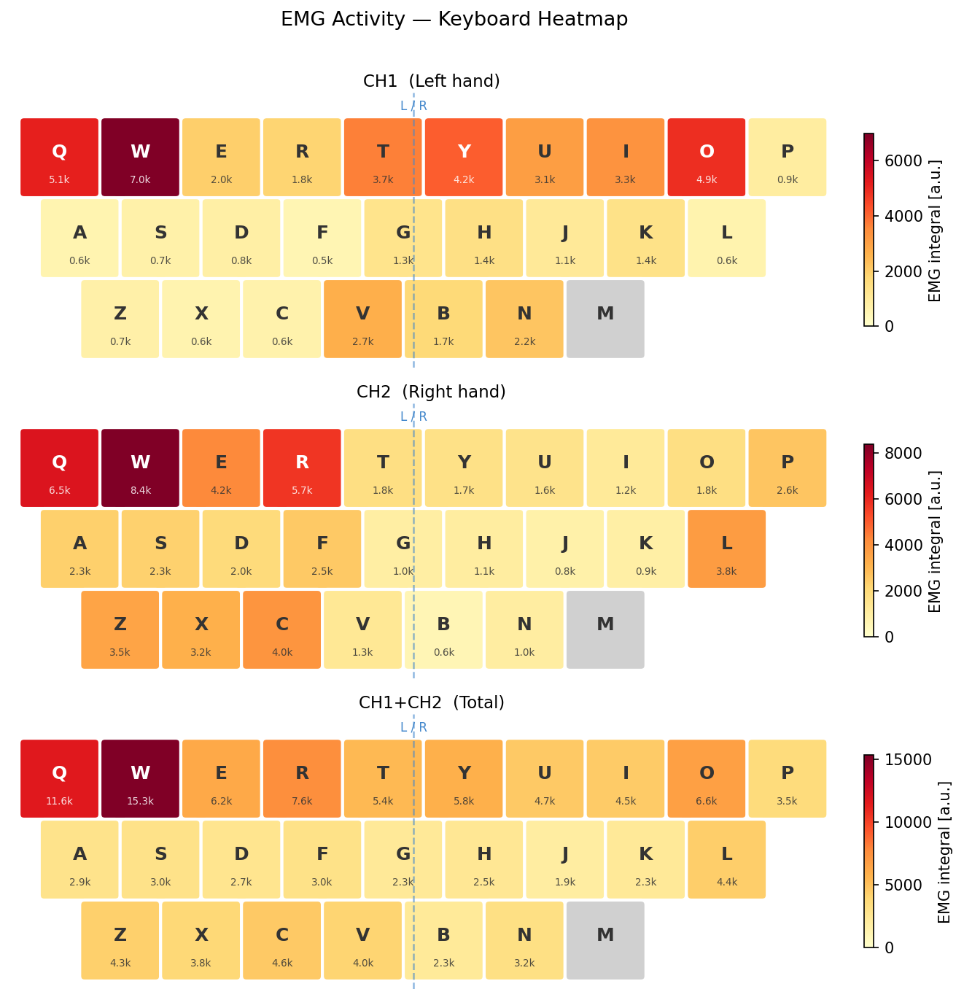
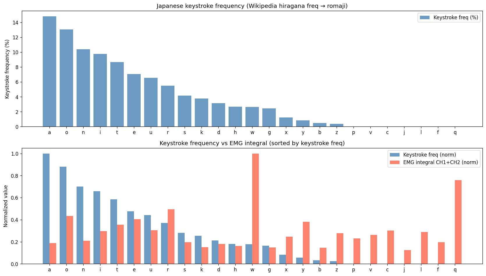
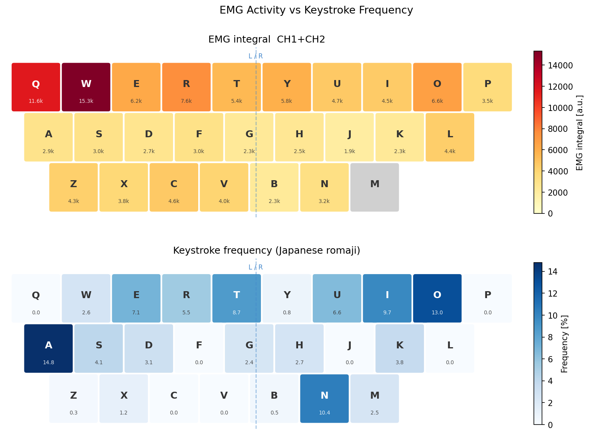
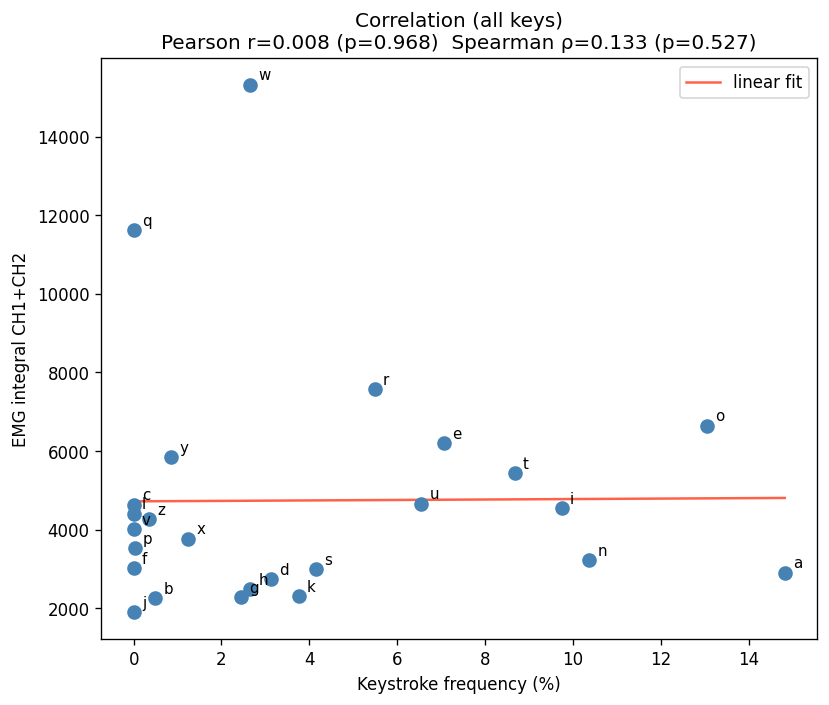
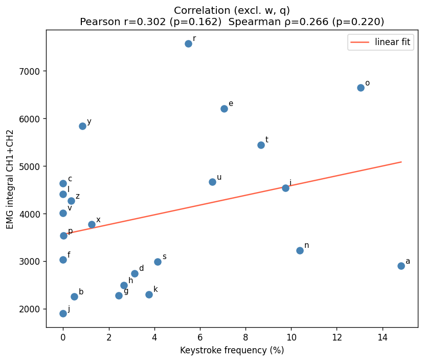
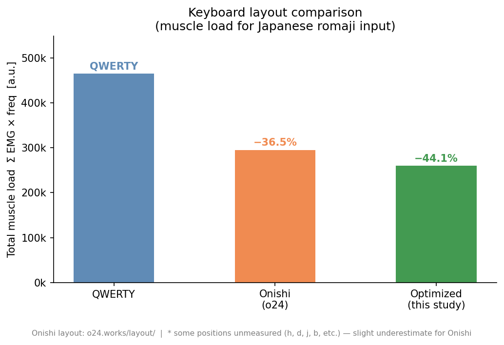

# キーボードタイピング時の筋電解析レポート

## 概要

QWERTYキーボードの各アルファベットキーをタイピングする際の筋電図（EMG）を計測し、**どのキーが筋負担を大きく要求するか**を明らかにした。また日本語ローマ字入力における打鍵頻度と照合することで、**現行のQWERTY配列が生理学的・人間工学的に最適かどうか**を検討した。

---

## 1. 実験概要

- **計測機器**: biosignalsplux（OpenSignalsフォーマット）
- **サンプリング周波数**: 1000 Hz
- **チャンネル**: 2ch（CH1: 左手筋、CH2: 右手筋）
- **課題**: QWERTYキーボードのアルファベット25キー（q → w → e → … → n）を順番に単打し、各キーごとに約11秒間計測

### 信号処理フロー

```
生EMG
  →  バンドパスフィルタ（Butterworth 4次、40–400 Hz）
  →  基線合わせ（平均除去）
  →  整流化（絶対値）
  →  RMSスムージング（100サンプル窓）
```

---

## 2. 各キーのEMG波形

フィルタ処理後の全25キー分の波形を示す。縦軸が筋活動量、横軸が時間（秒）。



上段のキー（q, w, e, r, t, y付近）で活動量が高い傾向が視覚的に確認できる。

---

## 3. キーごとの活動量ランキング

### チャンネル別ランキング（積分値・ピーク値）



### CH1 + CH2 合計ランキング



**主な観察結果:**

| 指標 | 上位キー | 下位キー |
|------|---------|---------|
| 積分値（CH1） | w, q, o, y, t | f, a, x, l, c |
| 積分値（CH2） | w, q, r, e, c | b, k, g, j |
| 積分値（合計） | **w > q > r > o > e** | j, b, k, g, h |

- **w と q が突出して高い**。これらは計測開始直後のファイルであり、緊張・準備不足による過剰な筋緊張の影響が疑われる。
- **CH1（左手）と CH2（右手）でランキングが大きく異なる**ことから、2チャンネルが異なる筋群の活動を反映していると考えられる。

---

## 4. キーボード上への筋活動マッピング

各キーポジションの筋活動量をキーボード形状上にヒートマップとして可視化した。



- **CH1（左手）**: 上段左側（Q・W・T・Y・O）で活動が大きい
- **CH2（右手）**: W・Q・R など左手キーでも活発で、クロストークまたは電極配置の影響が示唆される
- **中段・下段（A行・Z行）は全体的に低活動**

---

## 5. 日本語ローマ字入力の打鍵頻度との比較

### 打鍵頻度の算出方法

Wikipedia「文字の出現頻度」掲載のひらがな出現頻度（約2,071万字の日本語テキストから集計）をもとに、Nihon-shikiローマ字変換（MS-IME / Google IME デフォルト準拠）を適用し、アルファベット別の打鍵頻度を算出した。

> 出典: [Wikipedia — 文字の出現頻度](https://ja.wikipedia.org/wiki/%E6%96%87%E5%AD%97%E3%81%AE%E5%87%BA%E7%8F%BE%E9%A0%BB%E5%BA%A6)

**上位5キーの打鍵頻度:**

| 順位 | キー | 頻度 |
|------|------|------|
| 1 | a | 14.8% |
| 2 | o | 13.0% |
| 3 | n | 10.4% |
| 4 | i | 9.7% |
| 5 | t | 8.7% |

### EMGと打鍵頻度の比較





### 相関分析





| 条件 | Pearson r | p値 | Spearman ρ | p値 |
|------|-----------|-----|------------|-----|
| 全キー（n=25） | 0.008 | 0.968 | 0.133 | 0.527 |
| w・q除外（n=23） | 0.302 | 0.162 | 0.266 | 0.220 |

**考察:**

- **全キーでは相関なし（r ≈ 0）**。w と q の外れ値が全体の相関を完全に打ち消している。
- **w・q を除外すると弱い正相関（r = 0.30）**が現れるが、p = 0.16 で統計的有意水準には達しない。
- **a（頻度1位・EMG19位）**: 母音 a はホームポジション付近で指の移動が少なく、筋負担が小さい。これは生理学的に合理的。
- **w・q の外れ値**は計測バイアス（計測開始直後の緊張）の可能性が高い。複数試行・休憩導入により検証可能。
- 打鍵頻度が高いキー（a, o, n, i）の筋活動が低い傾向は確認できるが、**QWERTYが「頻度の高いキーを低負担ポジションに置く」配列設計をしているわけではない**ことが示唆される。

---

## 6. キーボード配列の最適化

各ポジションのEMG積分値をその「ポジションの筋負担コスト」として扱い、以下の目的関数を最小化するキー配置をハンガリアン法（線形割り当て問題）で求めた。

$$\text{minimize} \quad \sum_{i} \text{EMG}(\text{position}_i) \times \text{freq}(\text{letter}_j)$$

**高頻度文字 → 低EMGポジション**に割り当てることで、日本語ローマ字入力における総筋活動コストを最小化する。

### 最適化結果


- **背景色（赤→黄）**: そのポジションの筋活動コスト
- **青い円の大きさ**: そのキーの打鍵頻度（大きいほど高頻度）

中段（U・R・E・S・N・T・A・I）に大きな円が集まり、かつ背景が黄色い（低EMG）ことで、**頻出文字が低負担ポジションに集約**されていることが一目で確認できる。

---

## 7. 3配列の総筋活動コスト比較

QWERTY・大西配列（o24）・今回の最適配列の3つで Σ EMG × 打鍵頻度 を比較した。

> 大西配列について: [o24.works/layout/](https://o24.works/layout/) — 日本語ローマ字入力の打鍵効率最適化を目的として設計された配列



| 配列 | 総筋活動コスト | QWERTY比 |
|------|-------------|---------|
| QWERTY | 465,012 | — |
| 大西配列 (o24) | 295,321 | **−36.5%** |
| 今回の最適配列 | 259,961 | **−44.1%** |

**考察:**

- **大西配列は QWERTYより36.5%コスト低減**。大西配列は「交互打鍵率の向上」「ホームポジション使用率向上」を目的として設計されており、副次的に筋活動コストも低減される結果となった。
- **今回の最適配列は最もコストが低い（−44.1%）**が、これは今回の1名の被験者のEMGデータに特化した最適解であり、汎用性は限定的。
- 大西配列のカバー率が91.2%（QWERTYは97.5%）なのは、h・d・j・bなど一部の文字が今回の計測範囲外（;・,・.等のキー位置）に配置されているためで、**大西配列の実際のコストはやや過小評価の可能性がある**。

---

## 8. 総合考察とまとめ

### 主要な知見

1. **QWERTYは筋負担と打鍵頻度の間に有意な相関がない**。頻出文字（a, o, n, i）が必ずしも低負担ポジションにあるわけではなく、人間工学的な最適化がなされていないことが示唆される。

2. **大西配列は今回の被験者データでも36.5%の筋活動コスト低減を達成**した。これは交互打鍵・ホームポジション優先という設計方針が、筋活動量の観点からも支持されることを示す。

3. **個人の筋活動パターンに基づく最適配列**は理論上44%のコスト削減が可能だが、実用化には多数の被験者・反復計測・2連字（bigram）の考慮が必要。

### 限界と今後の課題

| 課題 | 詳細 |
|------|------|
| サンプル数 | 被験者1名・各キー単打1回のみ。複数試行・複数被験者での検証が必要 |
| 計測バイアス | w・q は計測開始直後で緊張の影響が疑われる。ランダム順計測が望ましい |
| Bigram非考慮 | 実際の入力では前後のキーとの連鎖（「の」= n→o など）が筋活動に影響する |
| 電極位置 | CH2が右手のはずにもかかわらず左手キーで高活動という結果は、電極配置の再検討を要する |
| ロードの定義 | 今回の「コスト = EMG積分値 × 打鍵頻度」は粗い近似。実際の累積疲労は打鍵間隔・手の移動距離なども考慮すべき |

---

*解析スクリプト: [process_EMG.py](process_EMG.py)*  
*データ出典: Wikipedia「文字の出現頻度」/ 大西配列: [o24.works/layout/](https://o24.works/layout/)*
